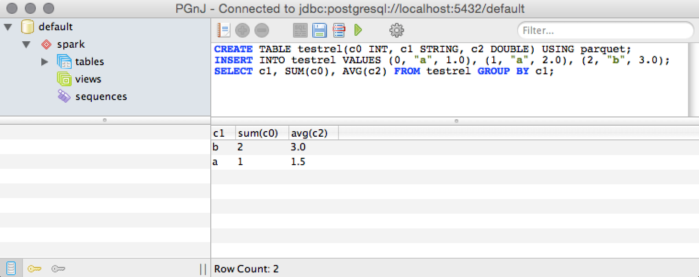

[](https://github.com/maropu/spark-sql-server/blob/master/LICENSE)
[](https://travis-ci.org/maropu/spark-sql-server)
<!---
[](https://coveralls.io/github/maropu/spark-sql-server?branch=master)
-->

A Spark SQL server based on the PostgreSQL V3 protocol.
For more information, see [SPARK-15816](https://issues.apache.org/jira/browse/SPARK-15816).

## Running the Spark SQL JDBC/ODBC server

To start the JDBC/ODBC server, check out this repository and run the following command in the root directory:

    $ ./sbin/start-sql-server.sh --conf spark.sql.server.psql.enabled=true

This script accepts all `bin/spark-submit` command line options in Spark, plus options for the SQL server.
You may run `./sbin/start-sql-server.sh --help` for a complete list of all available options.
If you use `spark-2.3.0`, you can add the option below to install the JDBC/ODBC server:

    $ ./bin/spark-shell --packages maropu:spark-sql-server:0.1.2-spark2.3

Then, you run the commands to launch the server:

    scala> sql("SET spark.sql.server.psql.enabled=true")
    scala> sql("SET spark.sql.crossJoin.enabled=true")
    scala> org.apache.spark.sql.server.SQLServer.startWithContext(spark.sqlContext)

Now, you can use a PostgreSQL `psql` command to test the SQL JDBC/ODBC server:

    $ psql -h localhost -d default

If you have no `psql` command and you use the Amazon Linux AMI, you can run `sudo yum install postgresql95`
to install PostgreSQL client programs. Since the SSL mode of this `psql` command is enabled by default,
you need to turn off the SSL mode to connect the SQL server:

    $ psql postgresql://localhost:5432/default?sslmode=disable

## Use PostgreSQL JDBC drivers

To connect the SQL server, you can use mature and widely-used [PostgreSQL JDBC drivers](https://jdbc.postgresql.org/).
You can get the driver, add it to a class path, and write code like;

```java
import java.sql.*;
import java.util.Properties;

public class JdbcTest {
  public static void main(String[] args) {
    try {
      // Register your PostgreSQL JDBC driver
      Class.forName("org.postgresql.Driver");

      // Connect to a 'default' database in the SPARK SQL server
      String dbName = "default";
      Properties props = new Properties();
      props.put("user", "maropu");
      Connection con = DriverManager.getConnection("jdbc:postgresql://localhost:5432/" + dbName, props);

      // Do something...
      Statement stmt = con.createStatement();
      stmt.executeQuery("CREATE TEMPORARY VIEW t AS SELECT * FROM VALUES (1, 1), (1, 2) AS t(a, b)").close();
      ResultSet rs = stmt.executeQuery("SELECT * FROM t");
      while (rs.next()) {
        System.out.println("a=" + rs.getInt("a") + " b=" + rs.getInt("b"));
      }
      rs.close();
      stmt.close();
      con.close();
    } catch (Exception e) {
      // Do error handling here...
    }
  }
}
```

This Spark SQL server supports the v42.x of PostgreSQL JDBC drivers [here](https://jdbc.postgresql.org/download.html).

## Use the PostgreSQL libpq C library

You can also use [`libpq`](https://www.postgresql.org/docs/current/static/libpq.html)
to connect the SQL server from C clients:

```
#include <stdio.h>
#include <stdlib.h>
#include <libpq-fe.h>

static void exit_nicely(PGconn *conn) {
    PQfinish(conn);
    exit(1);
}

int main(int argc, char **argv) {
    // Connect to a 'default' database in the SPARK SQL server''
    PGconn *conn = PQconnectdb("host=localhost port=5432 dbname=default");
    if (PQstatus(conn) != CONNECTION_OK) {
        exit_nicely(conn);
    }

    // Do something...
    PGresult *res = PQexec(conn, "SELECT * FROM VALUES (1, 1), (1, 2) AS t(a, b)");
    if (PQresultStatus(res) != PGRES_TUPLES_OK) {
        PQclear(res);
        exit_nicely(conn);
    }
    for (int i = 0; i < PQntuples(res); i++) {
        printf("a=%s b=%s\n", PQgetvalue(res, i, 0), PQgetvalue(res, i, 1));
    }

    PQclear(res);
    PQfinish(conn);
    return 0;
}
```

## GUI clients

You can also use some GUI clients (e.g., [PGnJ](http://thomasmango.com/projects/pgnj/));



Note that you need to set `false` at `spark.sql.server.binaryTransferMode` for the `PGnJ` client.

## Cursor mode

To enable a cursor mode on your JDBC driver, you make sure autocommit is off and you need to set fetch size
throught `Statement.setFetchSize` (See descriptions in [Chapter 5. Issuing a Query and Processing the Result](https://jdbc.postgresql.org/documentation/head/query.html#query-with-cursor));

```java
      // Make sure autocommit is off
      Connection con = DriverManager.getConnection("jdbc:postgresql://localhost:5432/" + dbName, props);
      con.setAutoCommit(false);

      // Turn use of the cursor on.
      Statement stmt = con.createStatement();
      stmt.setFetchSize(50);
      ResultSet rs = stmt.executeQuery("SELECT * FROM range(10000000)");
      while (rs.next()) {
        System.out.println("id=" + rs.getLong("id"));
      }
```

Also, you could set `spark.sql.server.incrementalCollect.enabled` for memory efficiency
when launching the SQL server. If enabled, the SQL server collects result data partition-by-parititon.

## PostgreSQL syntax

The SQL server supports some of PostgreSQL dialect;

    $psql -h localhost -d default
    Type "help" for help.

    maropu=> CREATE TEMPORARY VIEW t AS SELECT id AS key, id :: TEXT AS value FROM generate_series(0, 20, 5);
    --
    (0 rows)

    maropu=> SELECT * FROM t WHERE value ~ '^1;
     key | value
    -----+-------
      10 | 10
      15 | 15
    (2 rows)

## Authentication

### SSL Encryption

To enable SSL encryption, you need to set the following configurations in `start-sql-server.sh`;

    $ ./sbin/start-sql-server.sh \
        --conf spark.sql.server.ssl.enabled=true \
        --conf spark.sql.server.ssl.keystore.path=<your keystore path> \
        --conf spark.sql.server.ssl.keystore.passwd=<your keystore password>

If you use self-signed certificates, you follow 3 steps below to create self-signed SSL certificates;

    // Create the self signed certificate and add it to a keystore file
    $ keytool -genkey -alias ssltest -keyalg RSA -keystore server.keystore -keysize 2048

    // Export this certificate from server.keystore to a certificate file
    $ keytool -export -alias ssltest -file ssltest.crt -keystore server.keystore

    // Add this certificate to the client's truststore to establish trust
    $ keytool -import -trustcacerts -alias ssltest -file ssltest.crt -keystore client.truststore

You set the generated `server.keystore` to `spark.sql.server.ssl.keystore.path` and add a new entry (`ssl`=`true`) in `Properties`
when creating a JDBC connection. Then, you pass `client.truststore` when running `JdbcTest`
(See [the PostgreSQL JDBC driver documentation](https://jdbc.postgresql.org//documentation/head/ssl-client.html) for more information);

    $ javac JdbcTest.java

    $ java -Djavax.net.ssl.trustStore=client.truststore -Djavax.net.ssl.trustStorePassword=<password> JdbcTest

<!--
### Kerberos (GSSAPI) Supports

You can use the SQL server on a Kerberos-enabled cluster only in the YARN mode because Spark supports Kerberos only in that mode.
To enable GSSAPI, you need to set the following configurations in `start-sql-server.sh`;

    $ ./sbin/start-sql-server.sh \
        --conf spark.yarn.keytab=<keytab path for server principal> \
        --conf spark.yarn.principal=<Kerberos principal server>

Then, you set a Kerberos service name (`kerberosServerName`) in `Properties` when creating a JDBC connection.
See [Connection Parameters](https://jdbc.postgresql.org/documentation/head/connect.html#connection-parameters) for more information.
-->

## High Availability

A high availability policy of the Spark SQL server is along with [stand-alone Master one](http://spark.apache.org/docs/latest/spark-standalone.html#high-availability);
by utilizing ZooKeeper, you can launch multiple SQL servers connected to the same ZooKeeper instance.
One will be elected “leader” and the others will remain in standby mode.
If the current leader dies, another Master will be elected and initialize `SQLContext` with given configurations.
After you have a ZooKeeper cluster set up, you can enable high availability by starting multiple servers
with the same ZooKeeper configuration (ZooKeeper URL and directory) as follows;

    $ ./sbin/start-sql-server.sh \
        --conf spark.sql.server.recoveryMode=ZOOKEEPER \
        --conf spark.deploy.zookeeper.url=<ZooKeeper URL> \
        --conf spark.deploy.zookeeper.dir=<ZooKeeper directory to store recovery state>

To support simple connection fail-over, PostgreSQL JDBC drivers can define multiple endpoints (host and port pairs)
in the connection url separated by commas.
See [Connection Fail-over](https://jdbc.postgresql.org/documentation/head/connect.html#connection-failover) for more information.

## Run TPC-DS queries in Spark via the SQL server

You first need to generate test data for TPC-DS queries:

    $ git clone https://github.com/maropu/spark-tpcds-datagen.git
    $ ./bin/dsdgen --output-location /tmp/spark-tpcds-data

Then, launches the SQL server with a Spark standalone mode:

    $ ./sbin/start-sql-server.sh \
        --conf spark.master=local[*] \
        --conf spark.driver.extraJavaOptions=-XX:+UseG1GC \
        --conf spark.driver.memory=8g

Finally, runs TPC-DS queries against the SQL server:

    $ ./bin/run-tpcds-benchmark --data-location /tmp/spark-tpcds-data

[This benchmark code](./sql/tpcds/src/main/scala/org/apache/spark/sql/benchmark/TPCDSQueryBenchmark.scala)
is a good example about how to connect the SQL server with Postgre JDBC drivers.

## Bug reports

If you hit some bugs and requests, please leave some comments on [Issues](https://github.com/maropu/spark-sql-server/issues)
or Twitter([@maropu](http://twitter.com/#!/maropu)).

